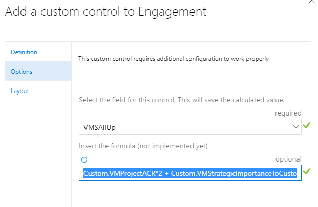

> Currently only available on TFS 2017 or later and Visual Studio Team Services. 

# How to get started
## Visual Studio Team Services

Navigate to your work item form customization page and add a CSE calculated fields control.

Edit the control so it can use the right field to store your final value and the formula. It supports formulas on the javascript notation, example:

> [Custom.MyField] * 2.5 + [Custom.MyField2] + (([Custom.MyField3] * 2) / 2) + Custom.Myfield4

Specify the fields by the fully qualified name "Prefix.FieldName" and enclosed on square brackets []

# How to query

The value is being saved to a string, integer or decimal field. It follows the same rules for query as the original field.

# Source code 

The [source](https://github.com/mahomedalid/azdevops-boards-extension-calculated-fields) for this extension can be found on github.

You can also learn how to build your own custom control extension for the work item form [here](https://www.visualstudio.com/en-us/docs/integrate/extensions/develop/custom-control). 

# Feedback 

We appreciate your feedback! Here are some ways to connect with us:

* Add a github issue.

> CSE Tools team is a internal Microsoft Team part of the Commercial Software Engineering group. Solutions in this category are designed for broad usage, and you are encouraged to use and provide feedback on them; however, these extensions are not supported nor are any commitments made as to their longevity.
